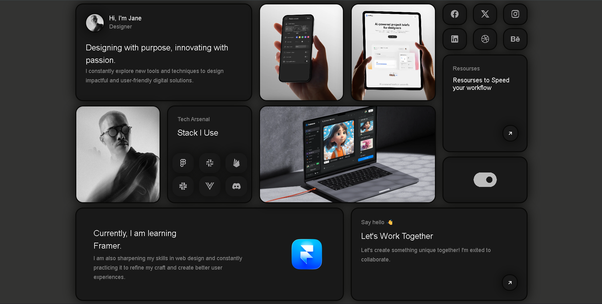

# 🍱 Minimal Bento Portfolio

## 🚀 Overview
A sleek, dark-themed personal portfolio showcasing a modern "Bento Box" UI design. This project focuses on clean aesthetics, smooth micro-interactions, and a highly organized visual hierarchy to present information, skills, and projects in a digestible format. 

## ✨ Features
* **Bento Box Layout:** Distinct, card-based interface for modular content presentation.
* **Dark Mode UI:** A professional and minimal dark theme with subtle shadow depths.
* **Smooth Hover Interactions:** Card scaling and shadow transitions for an interactive feel.
* **Icon Integration:** Lightweight and scalable iconography using Remix Icons.

## 🛠️ Technologies Used
* **HTML5:** Semantic structure and clean markup.
* **CSS3:** Advanced styling, CSS Grid (specifically `grid-template-areas`), custom properties, and transitions.
* **Remix Icons:** For scalable vector social and UI icons.

## 💡 Key Learnings
* **Mastering CSS Grid:** Leveraged `grid-template-areas` to map out complex, asymmetrical layouts efficiently.
* **UI/UX Principles:** Explored the Bento UI trend, focusing on spacing (gap), border-radius consistency, and visual hierarchy.
* **Micro-interactions:** Implemented CSS transitions on hover states to make the interface feel tactile and responsive without using JavaScript.

## 📸 Preview

**🟢 Live Demo:** [View the UI Card Here](https://bento-portfolio-ui.vercel.app/)

 

*A clean, dark-themed Bento Box portfolio built entirely with HTML and CSS Grid.*
